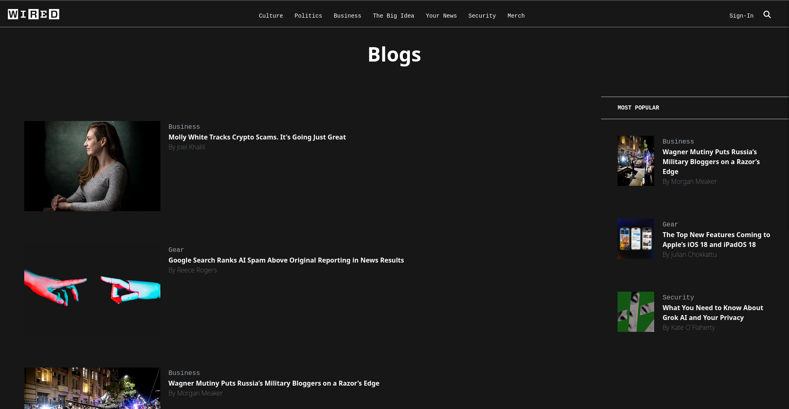

# Лабораторна робота No2
# Дисципліна: "Основи веб-розробки"

## Тема: CSS-фреймворк Tailwind CSS
## Мета:Ознайомитися з концепцією утилітарного CSS, на прикладі Tailwind CSS, для створення стилізованих веб-сторінок. Вивчити основні правила використання класів Tailwind та створення адаптивного дизайну.

# Студент:
Приваленко Артур ІПЗм-41

# Макет(адаптив)
### Компютерна Версія
 

### Мобільна Версія

